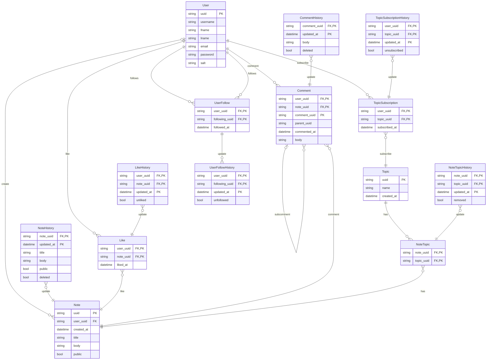

# Web Notes
A Modern App for Notes on the Web

## Services

### Application Services

- User Service
- Note Service
- Topic Service
- Feed Service
- API Service
- UI Service

### Infrastructure Services

- RPC Service
- Message Broker Service
- Reverse Proxy Service

## APIs

- [ ] POST /api/login

- [ ] POST /api/user
- [ ] GET /api/user/<uuid>
- [ ] GET /api/user/<uuid>/history
- [ ] UPDATE /api/user/<uuid>
- [ ] DELETE /api/user/<uuid>
- [ ] POST /api/user/<uuid>/follow
- [ ] POST /api/user/<uuid>/unfollow

- [ ] POST /api/note
- [ ] GET /api/note
- [ ] GET /api/note/<uuid>
- [ ] GET /api/note/<uuid>/history
- [ ] UPDATE /api/note/<uuid>
- [ ] DELETE /api/note/<uuid>
- [ ] POST /api/note/<uuid>/like
- [ ] POST /api/note/<uuid>/unlike

- [ ] POST /api/note/<uuid>/comment
- [ ] POST /api/note/<uuid>/comment/<uuid>
- [ ] GET /api/note/<uuid>/comment
- [ ] GET /api/note/<uuid>/comment/<uuid>
- [ ] UPDATE /api/note/<uuid>/comment/<uuid>
- [ ] DELETE /api/note/<uuid>/comment/<uuid>

- [ ] GET /api/topic
- [ ] GET /api/topic/<uuid>

- [ ] GET /api/feed

## ER Diagram

