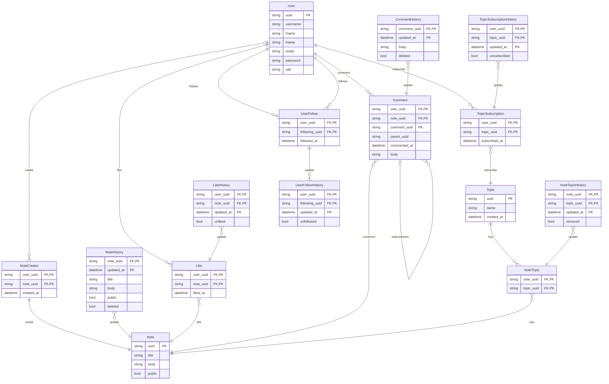

# web-notes
A Modern App for Notes on the Web

```mermaid
erDiagram
    User {
        string uuid PK
        string username
        string fname
        string lname
        string email
        string password
        string salt
    }

    Note {
        string uuid PK
        string title
        string body
        bool public
    }

    NoteCreator {
        string user_uuid FK,PK
        string note_uuid FK,PK
        datetime created_at
    }

    NoteHistory {
        string note_uuid FK,PK
        datetime updated_at PK
        string title
        string body
        bool public
        bool deleted
    }

    Like {
        string user_uuid FK,PK
        string note_uuid FK,PK
        datetime liked_at
    }

    LikeHistory {
        string user_uuid FK,PK
        string note_uuid FK,PK
        datetime updated_at PK
        bool unliked
    }

    Comment {
        string user_uuid FK,PK
        string note_uuid FK,PK
        string comment_uuid PK
        string parent_uuid
        datetime commented_at
        string body
    }

    CommentHistory {
        string comment_uuid FK,PK
        datetime updated_at PK
        string body
        bool deleted
    }

    Topic {
        string uuid PK
        string name
        datetime created_at
    }

    NoteTopic {
        string note_uuid FK,PK
        string topic_uuid FK,PK
    }

    NoteTopicHistory {
        string note_uuid FK,PK
        string topic_uuid FK,PK
        datetime updated_at PK
        bool removed
    }

    TopicSubscription {
        string user_uuid FK,PK
        string topic_uuid FK,PK
        datetime subscribed_at
    }

    TopicSubscriptionHistory {
        string user_uuid FK,PK
        string topic_uuid FK,PK
        datetime updated_at PK
        bool unsubscribed
    }

    UserFollow {
        string user_uuid FK,PK
        string following_uuid FK,PK
        datetime followed_at
    }

    UserFollowHistory {
        string user_uuid FK,PK
        string following_uuid FK,PK
        datetime updated_at PK
        bool unfollowed
    }

    User |o--o{ NoteCreator : "create"
    NoteCreator ||--|| Note : "create"
    NoteHistory }o--|| Note : "update"
    User ||--o{ Like : "like"
    Like }o--|| Note : "like"
    LikeHistory }o--|| Like : "update"
    User ||--o{ Comment : "comment"
    Comment }o--|| Note : "comment"
    Comment |o--o{ Comment : "subcomment"
    CommentHistory }o--|| Comment : "update"
    Topic ||--o{ NoteTopic : "has"
    NoteTopic }o--|| Note : "has"
    NoteTopicHistory }o--|| NoteTopic : "update"
    User ||--o{ TopicSubscription : "subscribe"
    TopicSubscription }o--|| Topic : "subscribe"
    TopicSubscriptionHistory }o--|| TopicSubscription : "update"
    User ||--o{ UserFollow : "follows"
    UserFollow }o--|| User : "follows"
    UserFollow ||--o{ UserFollowHistory : "update"
```
